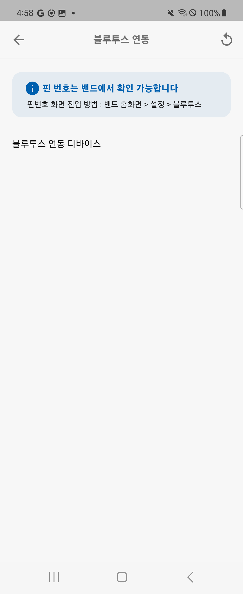

## HCM_Core 소개

헬스커넥트 모바일 개발에 사용되는 Core 라이브러리 입니다.  
아래의 기능을 지원합니다.
- Bluetooth
- API 통신
- Local DB (Hive)


## 개발 환경 설정
pubspec.yaml > dependencies에 해당 코드를 추가합니다.
```yaml
  hcm_core:
    git:
      url: https://github.com/hconnectdx/hcm_core.git
      ref: 0.0.3
```  


---
### HCApi
#### init

```dart
HCApi.initialize(
    baseUrl: 'https://mapi-stg.health-on.co.kr',
    headers: {
      'Content-Type': 'application/json',
    },
  );
```

#### POST
```dart
Response response = await HCApi.post(
      '/IF-HLO-CHMC-0300',
      data: {
        'userCountryNo': '82',
        'userMobileNo': userMobileNo,
        'userPwd': userPwd,
        'osType': Platform.isAndroid ? '90103200' : '90103100',
        'registrationId': HCApi.temp_token,
        'languageCode': '10801300',
        'appVersion': '1.2.7',
        'reqDate': "20231108171931",
      },
      headers: {
        'Content-Type': 'application/json',
      },
    );
```

#### GET
```dart
Response response = await HCApi.get(
      '/IF-HLO-CHMC-XXXX',
      queryParameters: {
        'id': userId
      },
      headers: {
        'Authorization': 'Bearer your_access_token'
      },
    );
```

#### DELETE
```dart
Response response = await HCApi.delete(
      '/IF-HLO-CHMC-XXXX',
      queryParameters: {
        'id': userId
      },
      headers: {
        'Authorization': 'Bearer your_access_token'
      },
    );
```

---
### HCDB
#### 저장
```dart
bool data = await HCDB.saveData(
                  {
                    'key1': 'value1',
                    'ket2': 'value2',
                  },
                );
```

#### 불러오기
```dart
await HCDB.getData('key1');
```
---
### BLE scan

```dart
BleScanView((connectedDevice) {
 // 스캔 후 연결한 디바이스 아이템이 콜백 됨
})
```
